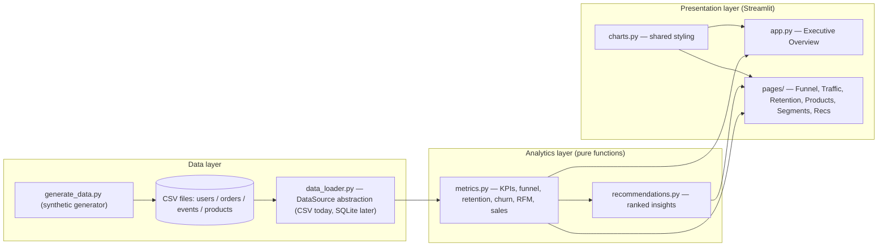
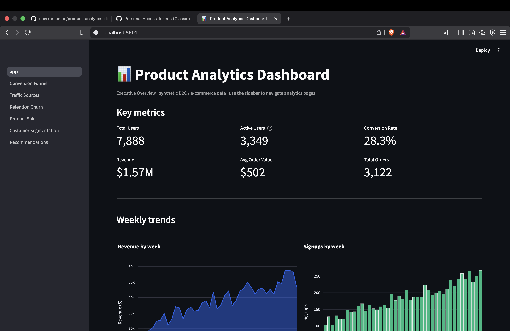
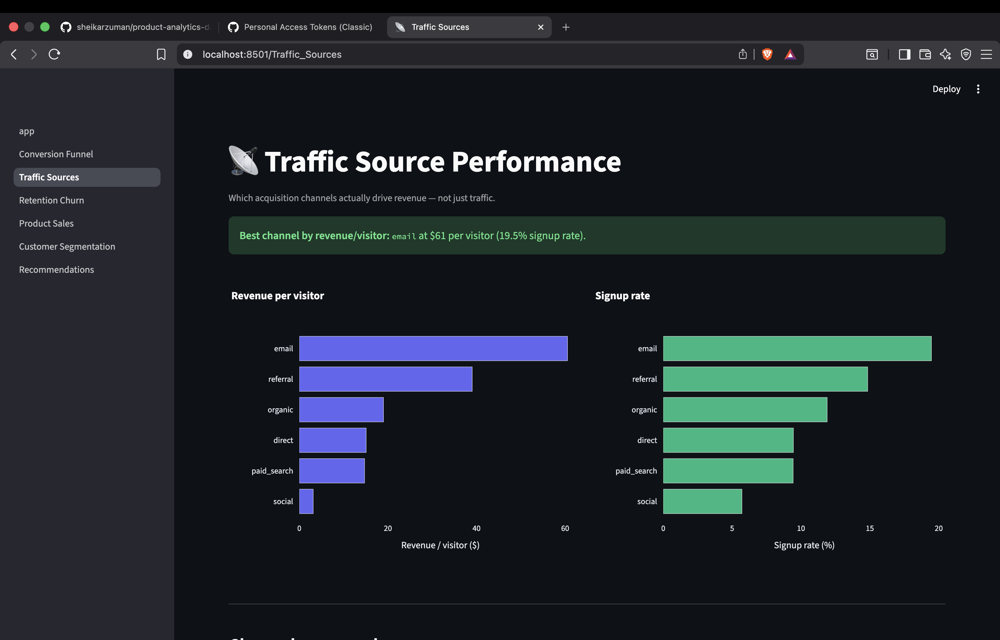
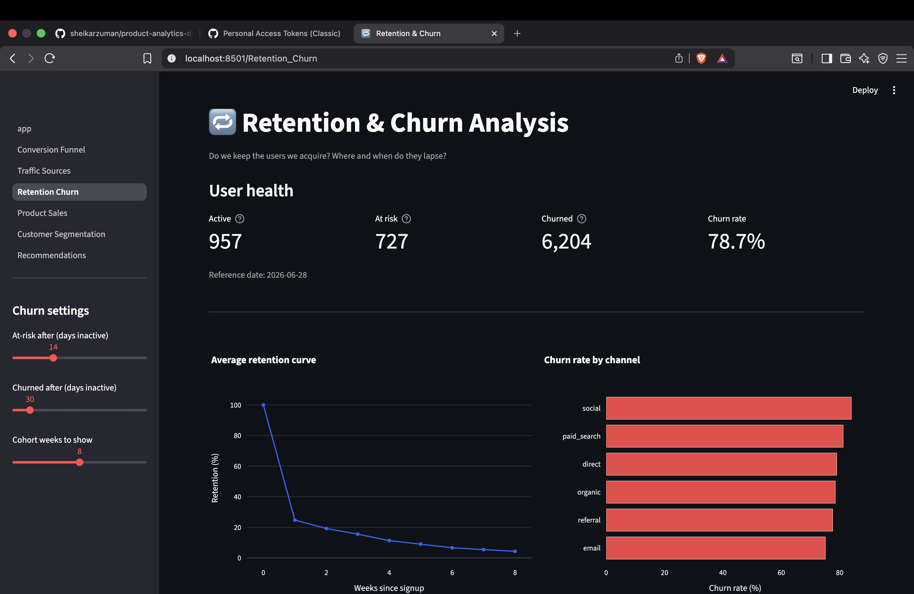
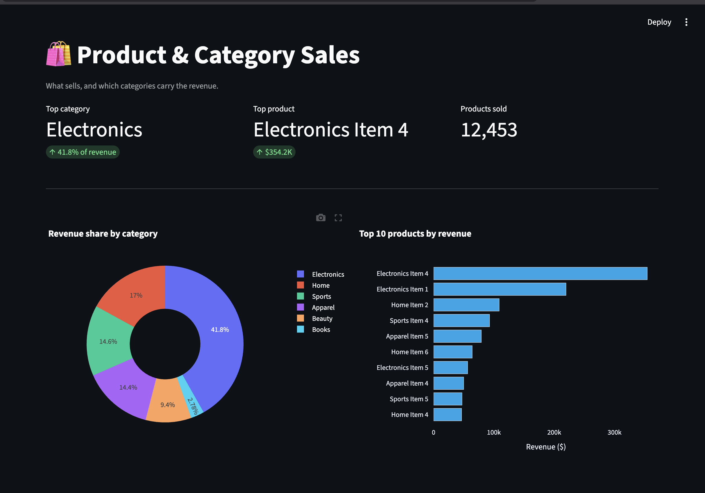
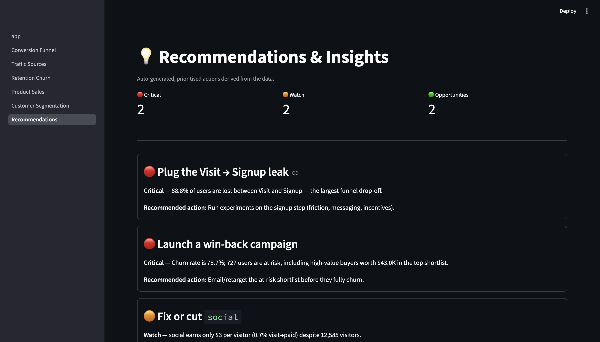

# 📊 Product Analytics Dashboard

An interactive analytics dashboard for a D2C / e-commerce business, built with
**Streamlit + Pandas + Plotly**. It turns raw event and order data into the
metrics a product or growth team actually uses — acquisition funnel, retention,
churn, channel performance, product sales and customer segments — and then
**auto-generates prioritised business recommendations** from those metrics.

> Built as a focused, one-week portfolio project. Emphasis on product thinking
> and business metrics, with clean, tested, modular code.

---

## ✨ Features

**KPI cards** — Total Users · Active Users · Conversion Rate · Revenue ·
Average Order Value (AOV) · Total Orders.

**Eight analytics pages**

| # | Page | What it answers |
|---|------|-----------------|
| 1 | Executive Overview | Headline KPIs + weekly revenue/signup trends |
| 2 | Conversion Funnel | Visit → Signup → Add to Cart → Purchase, biggest drop-off, funnel by channel |
| 3 | Traffic Sources | Channel performance ranked by revenue per visitor |
| 4 | Retention & Churn | Retention curve, cohort heatmap, churn segments, win-back list |
| 5 | Product & Category Sales | Revenue share, top products, category scorecard |
| 6 | Customer Segmentation | RFM segments (Champions, Loyal, At-Risk, …) |
| 7 | Recommendations & Insights | Auto-generated, severity-ranked actions |

**Recommendation engine** — surfaces the best/worst acquisition channel, the
largest funnel leak, top revenue products, churn signals and at-risk high-value
users, each with a concrete recommended action.

---

## 🧱 Architecture

A clean three-layer separation: **data → logic → presentation**. Metrics are
pure functions that receive DataFrames, so the data source is swappable and the
logic is unit-testable in isolation.



---

## 🗂️ Project structure

```
product-analytics-dashboard/
├── app.py                      # Streamlit entry point (Executive Overview)
├── requirements.txt
├── requirements-dev.txt        # + pytest
├── pytest.ini
├── README.md
├── CLAUDE.md                   # project notes / working agreement
├── data/                       # generated CSVs
│   ├── users.csv  orders.csv  events.csv  products.csv
├── src/
│   ├── generate_data.py        # synthetic dataset generator
│   ├── data_loader.py          # swappable data source (CSV → SQLite ready)
│   ├── metrics.py              # pure, typed business-metric functions
│   ├── recommendations.py      # rule-based insight engine
│   ├── charts.py               # shared Plotly styling/builders
│   └── utils.py                # formatting & date helpers
├── pages/                      # additional Streamlit pages (auto-discovered)
│   ├── 1_Conversion_Funnel.py
│   ├── 2_Traffic_Sources.py
│   ├── 3_Retention_Churn.py
│   ├── 4_Product_Sales.py
│   ├── 5_Customer_Segmentation.py
│   └── 6_Recommendations.py
├── tests/                      # pytest suite
│   ├── conftest.py  test_metrics.py  test_recommendations.py
├── assets/                     # architecture diagram, etc.
└── screenshots/                # dashboard screenshots for the README
```

---

## 🚀 Installation

```bash
# 1. (recommended) create a virtual environment
python -m venv .venv
source .venv/bin/activate          # Windows: .venv\Scripts\activate

# 2. install dependencies
pip install -r requirements.txt

# 3. generate the synthetic dataset (writes CSVs into data/)
python -m src.generate_data --users 8000

# 4. run the dashboard
streamlit run app.py
```

The app opens at http://localhost:8501. Use the left sidebar to switch pages.

---

## 🧪 Testing

```bash
pip install -r requirements-dev.txt
pytest
```

The suite uses small, deterministic fixtures with hand-checked expected values,
so any regression in a metric (KPIs, funnel, retention, churn, RFM,
recommendations) fails immediately.

---

## 🧬 Dataset

If no real data is supplied, `src/generate_data.py` creates a realistic
synthetic dataset (~8,000 users, ~91k events, ~6k order lines) with deliberate
business structure so the analyses have real signal:

- **Channels** (email, referral, organic, direct, paid_search, social) differ
  in volume, signup quality, engagement and AOV.
- A realistic **funnel** drop-off (visit → signup → add to cart → purchase).
- **Retention** decays week-over-week from each signup cohort.
- **Revenue** grows over the ~10-month window.

Data is reproducible (fixed random seed).

---

## 🔁 CSV → SQLite migration

All metrics receive plain DataFrames; nothing reads files directly. To migrate
from CSV to SQLite, switch the source returned by `get_source()` in
`src/data_loader.py` to `SQLiteDataSource(path)` — no metric, chart or page
code changes.

---

## 📸 Screenshots

Add screenshots of each page to `screenshots/` and reference them here, e.g.:

```markdown


```

To capture: run the app, open each page, and use your OS screenshot tool.

---

## 🛠️ Tech stack

Python 3.12+ · Pandas · Streamlit · Plotly · pytest · (SQLite-ready data layer)

---

## 🔮 Future improvements

- Churn-risk scoring model (logistic regression / gradient boosting)
- SQLite/DuckDB backend with incremental refresh
- Date-range and channel filters shared across pages
- Cohort LTV curves and payback period by channel
- CI (GitHub Actions) running the test suite on every push

---

## 📄 License

MIT — synthetic data, for portfolio/demo use.

## 🖼️ Dashboard preview

| | |
|---|---|
| **Executive Overview** | **Conversion Funnel** |
|  |  |
| **Traffic Sources** | **Retention & Churn** |
|  |  |
| **Product & Category Sales** | **Customer Segmentation** |
|  |  |
| **Recommendations & Insights** | |
|  | |
